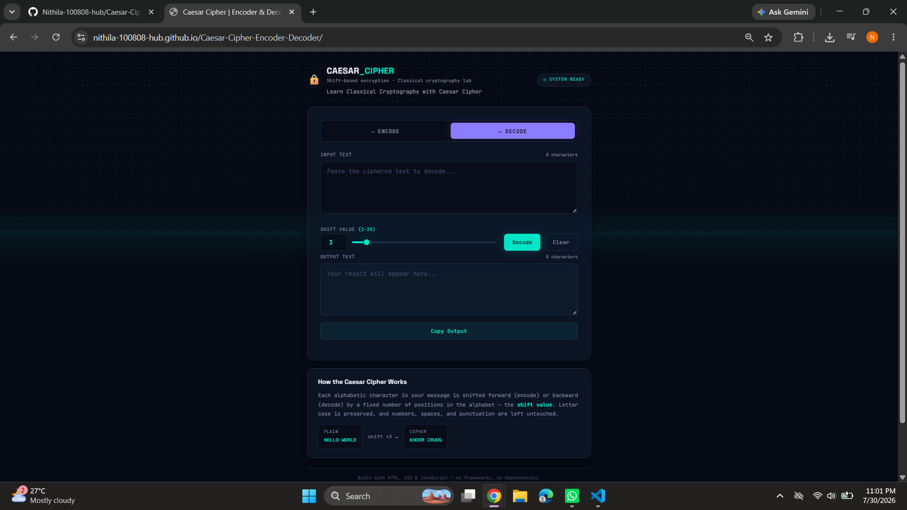

# 🔐 Caesar Cipher — Encoder & Decoder

A professional, single-page web app that encodes and decodes text using the
classical **Caesar Cipher** algorithm. Built as a cybersecurity mini-project
with a modern dark UI, glassmorphism panels, and zero external frameworks.


---

## ✨ Features

- **Encode & Decode modes** with a single toggle switch
- **Shift value control** from `1–25`, adjustable via number input *or* slider
- **Input validation** — empty text, non-numeric shifts, and out-of-range
  shifts all show clear inline error messages
- **Live character counters** on both the input and output boxes
- **Copy Output** button with clipboard API + fallback, and a toast confirmation
- **Clear** button to reset the whole form in one click
- **Preserves** spaces, numbers, and punctuation — only letters are shifted
- **Case-sensitive** — uppercase stays uppercase, lowercase stays lowercase
- **Fully responsive** — works cleanly from small phones to wide desktops
- **Smooth animations** — entrance transitions, animated status indicator,
  slider glow, and a subtle scanline sweep for atmosphere
- **Keyboard friendly** — press `Enter` in the input box to process instantly

---

## 📁 Folder Structure

```
caesar-cipher/
├── index.html      # Page structure & content
├── style.css       # Dark cybersecurity theme, layout, animations
├── script.js       # Cipher logic, validation, DOM interactivity
└── README.md        # Project documentation (this file)
```

Each file has a single responsibility, which keeps the project easy to read,
easy to extend, and easy to grade for a course assignment.

---

## 🧠 How the Cipher Works

The Caesar Cipher shifts every letter in a message forward through the
alphabet by a fixed number of positions (the **shift value**). To decode,
the same shift is applied in reverse.

```
Plain text:   H  E  L  L  O
Shift:       +3 +3 +3 +3 +3
Cipher text:  K  H  O  O  R
```

Mathematically, for a shift `s`, each letter is transformed using modular
arithmetic so the alphabet "wraps around" after `Z` (or `z`):

```
encoded_index = (original_index + s) mod 26
decoded_index = (original_index - s + 26) mod 26
```

Non-alphabetic characters (numbers, punctuation, spaces, emoji) are always
returned unchanged, and letter case is always preserved.

---

## ⚙️ Function Reference (`script.js`)

| Function                          | Purpose                                                              |
|-----------------------------------|------------------------------------------------------------------------|
| `shiftCharacter(character, shift)`| Shifts one character, respecting case, or returns it unchanged        |
| `caesarCipher(text, shift, mode)` | Runs `shiftCharacter` over an entire string for encode or decode      |
| `validateInputs()`                | Checks the text and shift value are valid before processing            |
| `showError(msg)` / `hideError()`  | Displays or clears the inline error banner                            |
| `updateCounters()`                | Refreshes the live character counts                                    |
| `syncShiftControls(source)`       | Keeps the number field and the slider in sync                          |
| `setMode(mode)`                   | Switches between Encode and Decode, updating labels and styling        |
| `showToast(message)`              | Displays a temporary confirmation toast (used after copying)          |
| `handleProcessClick()`            | Validates input, runs the cipher, writes the result                    |
| `handleClearClick()`              | Resets both text areas and the error state                            |
| `handleCopyClick()`               | Copies the output to the clipboard with a fallback for old browsers   |

---

## 🚀 Running the Project

No build step, no installs, no dependencies.

1. Download or clone the `caesar-cipher/` folder.
2. Open `index.html` directly in any modern browser (Chrome, Firefox, Edge, Safari).
3. Type a message, choose Encode or Decode, set a shift value, and click **Encode/Decode**.

---

## 📸 Project Preview



---

## 🎓 Why This Project Is a Good Cybersecurity Mini-Project

- Demonstrates a **foundational classical cipher** used as the entry point
  into cryptography courses.
- Shows how **modular arithmetic** underlies letter substitution ciphers.
- Reinforces **input validation** as a security-adjacent practice — never
  trust unchecked user input, even in a simple tool.
- Small enough to fully read and understand in one sitting, but polished
  enough to showcase real front-end engineering skill on a portfolio or resume.

---

## 🔭 Possible Extensions

- Add a **brute-force decoder** that tries all 25 shifts at once
- Add **frequency analysis** to auto-guess the likely shift on English text
- Support the **Vigenère cipher** as a "next level up" from Caesar
- Add **light/dark theme toggle**
- Persist the last used shift value with `localStorage`

---

## 📄 License

This project is released under the MIT License — free to use, modify, and
share for learning or portfolio purposes.
